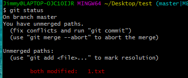
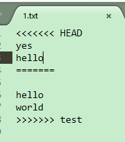
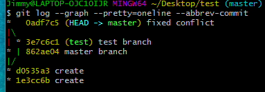
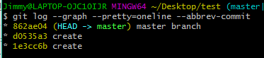

### Git tutorial

0. 安装后配置

      **git config --global user.name "你的名字"** 
      **git config --global user.email "你的邮件地址"** 

      ​

1. 在本机生成key，github添加ssh key，官方有文档

   第一步，创建SSH Key。在用户主目录下，看看有没有.ssh目录(C:\Users\jimmylian\.ssh)，如果有，再看看这个目录下有没有`id_rsa`和`id_rsa.pub`这两个文件，如果已经有了，可直接跳到下一步。如果没有，打开Shell（Windows下打开Git Bash），创建SSH Key：
   `ssh-keygen -t rsa -C "你的邮件地址"`

   第二步，登陆GitHub，打开“Account settings”，“SSH Keys”页面,然后，点“Add SSH Key”，填上任意Title，在Key文本框里粘贴`id_rsa.pub`文件的内容。

   ​

2. 初始化一个Git仓库，使用git init命令。

   ​

3. 添加文件到Git仓库，分两步：

  第一步，使用命令**git add \<file>**，注意，可反复多次使用，添加多个文件。就是把文件修改添加到暂存区（stage）。

  如果提示： LF will be replaced by CRLF，那么设置**git config --global core.autocrlf false**

  如果对文件夹内有几处操作，可以对文件夹add从而减少次数。

  第二步，使用命令**git commit -m "xxx"**，完成。实际上就是把暂存区的所有内容提交到当前分支。

  

  ​

4. 在本地创建了一个Git仓库后，又想在GitHub创建一个Git仓库，并且让这两个仓库进行远程同步

   第一步，在本地仓库下执行：**git remote add origin [git@github.com:jimmy-walker/git_tutorial.git](git@github.com:jimmy-walker/git_tutorial.git) ** ，远程库的名字就是origin，所以代表从远程得到origin库。

   第二步，执行**git push -u origin master**，我们第一次推送`master`分支时，加上了`-u`参数，代表upstream表示：Git不但会把本地的`master`分支内容推送的远程新的`master`分支，还会把本地的`master`分支和远程的`master`分支关联起来，在以后的推送或者拉取时就可以简化命令：`git push origin master`，代表将本地的master分支push到远端的origin分支。

   注：如果是直接从GitHub上clone下来的，那么修改后直接**git push origin master**即可。

   ​

5. 修改回撤

   常用操作已经用红圈圈出，注意git reset --soft我自己认为还不如直接用--hard。因为一般而言git commit后修改区域和暂存区域都是空的。

   `--` 的名称叫做double dash，是bash的内置命令，用来标记可选命令选项的结束。即在它后面的带 `--` 的字符串，不被当做是一个命令选项。

   > More precisely, a double dash (--) is used in bash built-in commands and many other commands to signify the end of command options, after which only positional parameters are accepted.

   举例：在 grep 命令中 `-V` 原本是一个可选的命令参数(options)，打印出 grep 命令的版本。

   但结合`--`后，以下命令表示在 d1.txt 文件中查找 "-V" 字符串`grep -- -V d1.txt`

   Git 的一些命令中，借鉴了这种用法。使用 `--` 去隔离开“树”与“路径”。

   例如，你想还原 一个文件 `path/to/file.txt`，在Git中使用如下命令

   `git checkout path/to/file.txt`

   但是天杀的居然有一个文件名字就叫做 "master"如果你套用上面的命令，想还原“master”文件

   `git checkout master`

   最终起的效果是变成切换到了master分支上。

   正确的做法是使用 `--`，这样它后面的字符串不会当做“树”，而认为是文件路径。

   `git checkout -- master`

   

   ​

6. 部分修改

   重要概念：**当修改与暂存区都无东西时，工作区与本地库相等。**如果有一个东西，那么说明两者不相等。而如果commit了a文件和b文件，想保留新的a文件和上一版本的b文件，那用**git reset HEAD^ b**把上一版本中的b文件重新放入缓存区以及修改处。**此时工作区和本地库相等都是HEAD版本，所以需要checkout和commit同时修改工作区和本地库**。

   

   ​

7. 删除文件


   其实这里的删除文件是上图中修改的一个例子而已。

   还是用上述方法添加到暂存区或是放弃修改，只不过除了add之外，还可以用**git rm**

   `git checkout`其实是用版本库里的版本替换工作区的版本，无论工作区是修改还是删除，都可以“一键还原”。


8. 分支管理：<u>分支是指向提交的指针，对应了一条线</u>

   **Git 的分支，其实本质上仅仅是指向提交对象的可变指针。 Git 的默认分支名字是 `master`。但是考虑从初始点到指针指向的提交点，可以认为分支对应一条线（时间线）。**

   在 Git 中，**HEAD是一个指向你正在工作中的本地分支的指针**（将 HEAD 想象为当前分支的别名。）

   Git鼓励你使用分支完成某个任务，合并后再删掉分支，这和直接在`master`分支上工作效果是一样的，但过程更安全。

   查看分支：`git branch`

   创建分支：`git branch <name>`

   切换分支：`git checkout <name>`

   创建+切换分支：`git checkout -b <name>`

   合并某分支到当前分支：`git merge <name>`

   删除分支：`git branch -d <name>`

   ​

9. 解决分支冲突：**如果在一个文件上两个分支都有操作，就会有分支冲突**。

   第一步：**大致流程，创建分支dev，修改后commit，回到master分支，修改后commit，然后merge合并**。

   第二步：**确保分支合并前，各自都已经commit完毕**：

   ​	注意分支和分支并不是完完全全的平行，多个分支是共用暂存区的。在切换分支前，一定要在做出改动的分支将改动提交，否则可能会将改动带到切换到的分支，产生误会。只要提前提交了，改动就不会带过去。不过只要原分支提交后，带到切换到的分支的改动也会自动消失。

   第三步：若冲突发生则手动整合冲突（如删除掉某一分支的修改）然后保存，再提交。

   ​	这个提交的操作就相当于你默认要提交的这个版本就是无冲突的合并版本。 实际上就是人肉修改冲突文件：打开需要合并的文件，找到冲突内容，选择一个版本保留，然后提交你选择后的结果。既然说是选择，所以你甚至可以选择什么冲突都不修改的提交。只不过文件中的冲突内容会很突兀的在那里杵着，就像这样：

   ```
   <<<<<<< HEAD
   xxxxxxxWWWWWWLLLLLLLL   # 这是来自当前分支的修改
   =======
   xxxxxxxaAAAAAAA            # 这是来自feature1分支的修改
   >>>>>>> feature1
   ```

   ​	而不是整合好冲突后干干净净的样子：

   ```
   xxxxxxxaAAAAAAA      # 这是我选择留下的修改
   ```

   第四步：具体例子：

   1）merge时发生冲突，会有提示：

   

   2）此时无法切换到其他分支，会有提示：

   

   3）查看status，会告诉我们哪里冲突了（在合并前git status实际上是无提示的）：

   

   4）打开文件进行修改：

   

   5）修改后将文件commit -am，此时git status就会提示消失：

   

   ​

   6）此时使用命令查看会发现分支合并了：git log --graph --pretty=oneline --abbrev-commit

   注意其中分支切换时会用绿色提示（只要记得是次级的那两个合并在了一起即可）。

   

   对应此图（但是不要去想着让上下两图的边对应，暂时无法做到这样理解）：

   

   下图是在冲突前的状态，便于理解。

   

   7）再删除其他分支即可：git branch -d test

   ​

10. 参与GitHub项目

  第一步：登录GitHub的项目主页，Fork克隆一个仓库：

  ​	比如人气极高的bootstrap项目，这是一个非常强大的CSS框架，你可以访问它的项目主页，点“Fork”就在自己的账号下克隆了一个bootstrap仓库，然后，从自己的账号下clone。

  第二步：对git clone到本地的仓库进行更改：

  ​	Bootstrap的官方仓库`twbs/bootstrap`、你在GitHub上克隆的仓库`my/bootstrap`，以及你自己克隆到本地电脑的仓库，他们的关系就像下图显示的那样。

  第三步：pull request：

  ​	如果你希望bootstrap的官方库能接受你的修改，你就可以在GitHub上发起一个pull request。当然，对方是否接受你的pull request就不一定了。

