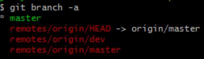

# Git tutorial

[TOC]

##-1. 非常好的在线可视化教程沙盒和无需代码的手动方案
https://github.com/pcottle/learnGitBranching

<https://guides.github.com/activities/hello-world/> 

##0. 安装后配置

  git config --global user.name "你的名字"
  git config --global user.email "你的邮件地址" 

##1. 在本机生成key，github添加ssh key，官方有文档

  第一步，创建SSH Key。在用户主目录下，看看有没有.ssh目录(C:\Users\jimmylian\.ssh)，如果有，再看看这个目录下有没有id_rsa和id_rsa.pub这两个文件，如果已经有了，可直接跳到下一步，如果没有，打开Shell（Windows下打开Git Bash），创建SSH Key：
  `ssh-keygen -t rsa -C "你的邮件地址"`

  第二步，登陆GitHub，打开“Account settings”，“SSH Keys”页面,然后，点“Add SSH Key”，填上任意Title，在Key文本框里粘贴`id_rsa.pub`文件的内容。

##2. 初始化一个Git仓库，使用git init命令。

##3. 添加文件到Git仓库，分两步：

  第一步，使用命令**git add \<file>**，注意，可反复多次使用，添加多个文件。就是把文件修改添加到暂存区（stage）。
  如果提示： LF will be replaced by CRLF，那么设置**git config --global core.autocrlf false**
  如果对文件夹内有几处操作，可以对文件夹add从而减少次数。

  第二步，使用命令**git commit -m "xxx"**，完成。实际上就是把暂存区的所有内容提交到当前分支。

  

##4. 在本地创建了一个Git仓库后，又想在GitHub创建一个Git仓库，并且让这两个仓库进行远程同步

  第一步，在本地仓库下执行：**git remote add origin [git@github.com:jimmy-walker/git_tutorial.git](git@github.com:jimmy-walker/git_tutorial.git) ** ，远程库的名字就是origin，所以代表从远程得到origin库。

  第二步，执行**git push -u origin master**，我们第一次推送`master`分支时，加上了`-u`参数，代表upstream表示：Git不但会把本地的`master`分支内容推送的远程新的`master`分支，还会把本地的`master`分支和远程的`master`分支关联起来，在以后的推送或者拉取时就可以简化命令：`git push origin master`，代表将本地的master分支push到远端的origin分支。
  注：如果是直接从GitHub上clone下来的，那么修改后直接**git push origin master**即可。

##5. 修改回撤

  常用操作已经用红圈圈出，注意git reset --soft我自己认为还不如直接用--hard。因为一般而言git commit后修改区域和暂存区域都是空的。
  `--` 的名称叫做double dash，是bash的内置命令，用来标记可选命令选项的结束。即在它后面的带 `--` 的字符串，不被当做是一个命令选项。
  More precisely, a double dash (--) is used in bash built-in commands and many other commands to signify the end of command options, after which only positional parameters are accepted.
  举例：在 grep 命令中 `-V` 原本是一个可选的命令参数(options)，打印出 grep 命令的版本。
  但结合`--`后，以下命令表示在 d1.txt 文件中查找 "-V" 字符串`grep -- -V d1.txt`
  Git 的一些命令中，借鉴了这种用法。使用 `--` 去隔离开“树”与“路径”。
  例如，你想还原 一个文件 `path/to/file.txt`，在Git中使用如下命令
  `git checkout path/to/file.txt`
  但是天杀的居然有一个文件名字就叫做 "master"如果你套用上面的命令，想还原“master”文件
  `git checkout master`
  最终起的效果是变成切换到了master分支上。
  正确的做法是使用 `--`，这样它后面的字符串不会当做“树”，而认为是文件路径。
  `git checkout -- master`

  

##6. 部分修改

  重要概念：**当修改与暂存区都无东西时，工作区与本地库相等。**如果有一个东西，那么说明两者不相等。而如果commit了a文件和b文件，想保留新的a文件和上一版本的b文件，那用**git reset HEAD^ b**把上一版本中的b文件重新放入缓存区以及修改处。**此时工作区和本地库相等都是HEAD版本，所以需要checkout和commit同时修改工作区和本地库**。

  

##7. 删除文件

  其实这里的删除文件是上图中修改的一个例子而已。
  还是用上述方法添加到暂存区或是放弃修改，只不过除了add之外，还可以用**git rm**
  `git checkout`其实是用版本库里的版本替换工作区的版本，无论工作区是修改还是删除，都可以“一键还原”。

##8. 分支管理：<u>分支是指向提交的指针，对应了一条线</u>

  **Git 的分支，其实本质上仅仅是指向提交对象的可变指针。 Git 的默认分支名字是 `master`。但是考虑从初始点到指针指向的提交点，可以认为分支对应一条线（时间线）。**
  在 Git 中，**HEAD是一个指向你正在工作中的本地分支的指针**（将 HEAD 想象为当前分支的别名。）
  Git鼓励你使用分支完成某个任务，合并后再删掉分支，这和直接在`master`分支上工作效果是一样的，但过程更安全。
  查看分支：`git branch`
  创建分支：`git branch <name>`
  切换分支：`git checkout <name>`
  创建+切换分支：`git checkout -b <name>`
  合并某分支到当前分支：`git merge <name>`
  删除分支：`git branch -d <name>`

##9. 解决分支冲突：**如果在一个文件上两个分支都有操作，就会有分支冲突**。

  第一步：**大致流程，创建分支dev，修改后commit，回到master分支，修改后commit，然后merge合并**。

  第二步：**确保分支合并前，各自都已经commit完毕**：
  注意分支和分支并不是完完全全的平行，多个分支是共用暂存区的。在切换分支前，一定要在做出改动的分支将改动提交，否则可能会将改动带到切换到的分支，产生误会。只要提前提交了，改动就不会带过去。不过只要原分支提交后，带到切换到的分支的改动也会自动消失。

  第三步：若冲突发生则手动整合冲突（如删除掉某一分支的修改）然后保存，再提交。
  这个提交的操作就相当于你默认要提交的这个版本就是无冲突的合并版本。 实际上就是人肉修改冲突文件：打开需要合并的文件，找到冲突内容，选择一个版本保留，然后提交你选择后的结果。既然说是选择，所以你甚至可以选择什么冲突都不修改的提交。只不过文件中的冲突内容会很突兀的在那里杵着，就像这样：

  

  第四步：具体例子：
  1）merge时发生冲突，会有提示：

  

  2）此时无法切换到其他分支，会有提示：

  

  3）查看status，会告诉我们哪里冲突了（在合并前git status实际上是无提示的）：

  

  4）打开文件进行修改：

  

  5）修改后将文件commit -am，此时git status就会提示消失：

  

  6）此时使用命令查看会发现分支合并了：git log --graph --pretty=oneline --abbrev-commit
  注意其中分支切换时会用绿色提示（只要记得是次级的那两个合并在了一起即可）。

  

  对应此图（但是不要去想着让上下两图的边对应，暂时无法做到这样理解）：

  

  下图是在冲突前的状态，便于理解。

  

  7）再删除其他分支即可：git branch -d test

##10. 分支基础知识

  Git提供Remote-tracking branches。远程跟踪分支是远程分支状态的引用。 **它们是你不能移动的本地引用，当你做任何网络通信操作时，它们会自动移动。 J其实提示的ahead of等信息就是根据这个来推算的。**只要你不与 origin 服务器连接，你的 `origin/master` 指针就不会移动。

  

  

  远程跟踪分支像是你上次连接到远程仓库时，那些分支所处状态的书签。当git clone后，Git 的 `clone` 命令会为你自动将其命名为 `origin`，拉取它的所有数据，创建一个指向它的 `master` 分支的指针，并且在本地将其命名为 `origin/master`。 Git 也会给你一个与 origin 的 `master` 分支在指向同一个地方的本地 `master` 分支，这样你就有工作的基础。绿色的分支是本地分支。红色的分支就是远程跟踪分支Remote-tracking branches。 J本地master上的*就等于那个HEAD分支的作用。

  

  **Git默认只显示master分支的数据，还需要手动切换到我们需要的分支并显示出来。**
  ```git checkout -b dev origin/dev```

  

##11. 分支管理策略

  第一种情况：对dev分支更新不同的文件。

  第一步：运行 git fetch origin 命令。 这个命令查找 “origin” 是哪一个服务器，从中抓取本地没有的数据，并且更新本地数据库，移动 origin/master 指针指向新的、更新后的位置。
  **<u>J如果没有更新，那就不会显示，那么我们就不用管了，就说明没有更新。</u>**

  

  1）git fetch命令
  git fetch <远程主机名>
  上面命令将某个远程主机的更新，全部取回本地。
  git fetch <远程主机名> <分支名>
  上面的命令取回特定分支的更新。
  所取回的更新，在本地主机上要用"远程主机名/分支名"的形式读取。比如origin主机的master，就要用origin/master读取。
  取回远程主机的更新以后，可以在它的基础上，使用git checkout命令创建一个新的分支。
  git checkout -b dev origin/dev
  2）或者直接使用**git fetch origin master:temp** 
  这句命令的意思是：从远程的origin仓库的master分支下载到本地并新建一个分支temp

  第二步：查看origin/dev与当前dev区别，如果没有区别，就不会显示。查**看对比，上下移动，q键退出。**
  **git diff origin/dev**

  第三步：git merge temp，解决冲突后合并。
  **<u>J如果发生冲突要么重新clone，要么就解决冲突，再merge。如果是merge的话，最后查看git status，看是否需要git push。</u>**

  第二种情况：合并dev与master分支
  其实该情况与上述类似，因为master分支一直不动，所以origin/master必然相同，可以先查看与origin/master的dif。f那么就本地merge下dev即可，再push。

##12. pull and push

  **分支推送顺序的写法是<来源地>:<目的地>**，所以`git pull`是<远程分支>:<本地分支>，而`git push`是<本地分支>:<远程分支>。

  第一步：`git pull`命令的作用是，取回远程主机某个分支的更新，再与本地的指定分支合并。它的完整格式稍稍有点复杂。
  ```git pull <远程主机名> <远程分支名>:<本地分支名>```
  如果远程分支是与当前分支合并，则冒号后面的部分可以省略。
  ```git pull <远程主机名> <远程分支名>```
  **J这等同于先做`git fetch`，再做`git merge`**
  如果当前分支与远程分支存在追踪关系，`git pull`就可以省略远程分支名。**J这就是我平时经常这么做的**
  ```git pull origin```

  第二步：`git push`命令用于将本地分支的更新，推送到远程主机。它的格式与`git pull`命令相仿。
  ```git push <远程主机名> <本地分支名>:<远程分支名>```
  如果当前分支与远程分支之间存在追踪关系，则本地分支和远程分支都可以省略。**J这就是我经常这么干的**
  ```git push origin```

  第三步：
  1）如果省略远程分支名，则表示将本地分支推送与之存在"追踪关系"的远程分支（通常两者同名），如果该远程分支不存在，则会被新建。**J这就是我经常这么干的**
  ```git push origin master```
  上面命令表示，将本地的`dev`分支推送到`origin`主机的`dev`分支。如果后者不存在，则会被新建。
  2）删除：如果省略本地分支名，则表示删除指定的远程分支，因为这等同于推送一个空的本地分支到远程分支。
  git push origin :dev 等同于git push origin --delete dev
  上面命令表示删除`origin`主机的`dev`分支。
  如果远程主机删除了某个分支，默认情况下，`git pull` 不会在拉取远程分支的时候，删除对应的本地分支。这是为了防止，由于其他人操作了远程主机，导致`git pull`不知不觉删除了本地分支。
  但是，你可以改变这个行为，加上参数 `-p` 就会在本地删除远程已经删除的分支。
  ```git fetch -p```

##13. 多人协作

  第一步：首先，可以试图用`git push origin branch-name`推送自己的修改；

  第二步：如果推送失败，则因为远程分支比你的本地更新，需要先用`git pull`试图合并；

  第三步：如果合并有冲突，则解决冲突，并在本地提交；

  第四步：没有冲突或者解决掉冲突后，再用`git push origin branch-name`推送就能成功！
  如果`git pull`提示“no tracking information”，则说明本地分支和远程分支的链接关系没有创建，用命令`git branch --set-upstream branch-name origin/branch-name`。

##14. 参与GitHub项目

  第一步：登录GitHub的项目主页，Fork克隆一个仓库：
  比如人气极高的bootstrap项目，这是一个非常强大的CSS框架，你可以访问它的项目主页，点“Fork”就在自己的账号下克隆了一个bootstrap仓库，然后，从自己的账号下clone。

  第二步：对git clone到本地的仓库进行更改：
  Bootstrap的官方仓库`twbs/bootstrap`、你在GitHub上克隆的仓库`my/bootstrap`，以及你自己克隆到本地电脑的仓库，他们的关系就像下图显示的那样。

  第三步：pull request：
  如果你希望bootstrap的官方库能接受你的修改，你就可以在GitHub上发起一个pull request。当然，对方是否接受你的pull request就不一定了。

  

## 15. 发布到Gitbook

  第一步：修改GitHub代码，增加Gitbook必要的README.md和SUMMARY.md文件。

  

  其中文本内容放入README.md中，而SUMMARY.md文件作为目录文件：

  

  第二步：进入Gitbook中绑定GitHub。进入GitHub选项卡，点击保存，点击sync，通过update可以看到状态。

  

  

  

## 16. Gitbook公式
  在gitbook中，对于需要使用公式的markdown文件，需要将其进行替换，从\$替换到\$\$。

一种方法：

首先需要安装[nodejs](http://nodejs.cn/download/)，然后安装gitbook：

```
npm install -g gitbook-cli
```

  然后在文件夹下新建book.json

```
{
    "plugins": ["mathjax"],
    "pdf": {
        "fontSize": 12,
        "footerTemplate": null,
        "headerTemplate": null,
        "margin": {
            "bottom": 36,
            "left": 62,
            "right": 62,
            "top": 36
        },
        "pageNumbers": false,
        "paperSize": "a4"
    }
}

```

  本来还有一段，经测试，不需要也没问题。
```
"styles": {
    "latex-codecogs": "styles/latex-codecogs.css"
}
```

最后在根目录运行安装插件

```
gitbook install ./
```

另一种方法是：将gitbook中的setting切换到default版本，然后只加入book.json，默认就支持mathjax。

## 17. 相关问题

  当输入git branch -a时，一般而言会包括```remotes/origin/HEAD -> origin/master```
  但是当没有这一项时说明丢失了，如下图，可以通过下列命令找回来```git symbolic-ref refs/remotes/origin/HEAD refs/remotes/origin/master```
  

  实际上没有任何影响。因为解释为：`remotes\origin\HEAD` indicates the default branch on the remote. The logic is that you can then use `origin` as a shorthand whenever you would otherwise use `origin/master`. E.g. it makes `git log origin/master` equivalent to `git log origin`.
  所以**a remote HEAD ref is only used for cloning, and never required by Git at a later time**. 

##18.常用操作
###推送本地创建的新分支到远端

```shell
#Create a new branch:
git checkout -b experiments
#Edit, add and commit your files.
#Push your branch to the remote repository:
git push -u origin experiments #u means set upstream
```

##19.代理配置

v2ray的代理配置，添加监听端口即可

```shell
#查看配置
git config --global --list

#配置
git config --global http.proxy 'socks5://127.0.0.1:监听端口'
git config --global https.proxy 'socks5://127.0.0.1:监听端口'

#删除配置
git config --global --unset http.proxy
git config --global --unset https.proxy
```

